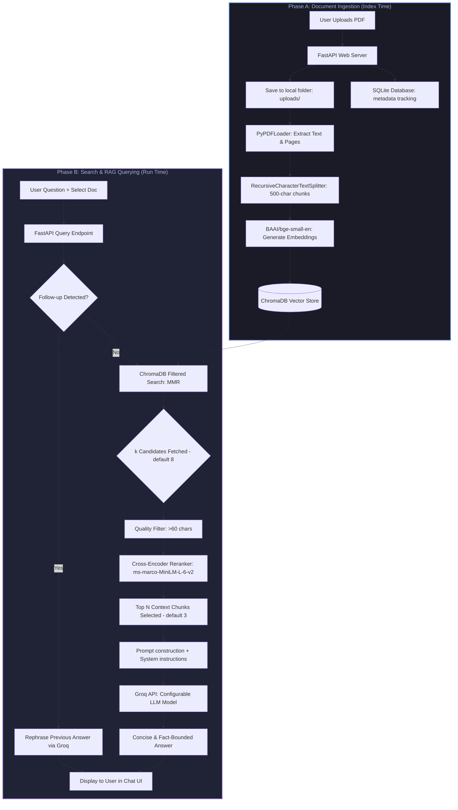

# 🤖 Advanced PDF-RAG ChatBot

An elite, high-performance **Retrieval-Augmented Generation (RAG)** system designed to ingest, process, and query PDF documents with extreme precision. Built using a modern **FastAPI** backend, **ChromaDB** vector database, local embedding & reranking models, and **Groq's Llama 3.3** model for near-instantaneous contextual answers.

This project delivers a state-of-the-art RAG pipeline, complete with a beautiful, responsive, glassmorphic frontend interface featuring fluid background particle effects, **persistent multi-turn chat memory**, **intelligent follow-up question detection**, and a fully configurable **Model Settings Panel**.

---

## 🗺️ Architectural Workflow

The system is split into two primary pipelines: **A) Document Ingestion** (processing and indexing files) and **B) Search & RAG Querying** (retrieval, filtering, reranking, and generation).



---

## ⚡ Under the Hood: Detailed Mechanics

To ensure answers are highly accurate and completely free of hallucinations, this application does not simply search and generate. It uses a **multi-layered validation and hybrid retrieval architecture**.

### 1. Document Ingestion & Text Chunking
* **Text Extraction:** When a PDF is uploaded, LangChain's `PyPDFLoader` parses the document layout, preserving page-wise metadata.
* **Separation Normalization:** Paths are normalized to standard forward slashes (`/`) so metadata matches seamlessly whether the server runs on Windows, macOS, or Linux.
* **Smart Text Splitting:** Documents are split using a `RecursiveCharacterTextSplitter` into **500-character chunks with a 50-character overlap**. This ensures that semantic paragraphs and sentences are not split abruptly, preserving context across chunk boundaries.
* **Metadata Association:** Each text chunk is stamped with its source filename and page number.

### 2. High-Dimensional Vector Embeddings
* **Embedding Model:** `BAAI/bge-small-en` (via HuggingFace) is run locally. It embeds 500-character chunks into high-dimensional vector spaces. BGE-small is highly optimized, fast, and beats larger models on retrieval benchmarks while having a lightweight memory footprint.
* **Vector Storage:** The vectors are stored in a local **ChromaDB** instance (`./chroma_db`).

### 3. Smart Dual-Layer Query Retrieval
When you ask a question about a specific document, the retriever acts as a **two-layer gatekeeper**:
* **Layer 1: Metadata Filter:** The search is strictly locked down to the selected document using ChromaDB's native metadata filtering. This guarantees that your question is *only* evaluated against the selected file, preventing context-leaks from other uploaded documents.
* **Fallback Safety-Net:** In case the underlying vector store library ignores the metadata filter (a known issue in certain version combinations of LangChain/ChromaDB), a bulletproof **Python-level source filter** acts as a backup, dropping any chunk that does not originate from the target document.
* **Quality Filtering:** Any chunk containing less than 60 characters (e.g., page numbers, single words, footer fragments) is instantly discarded, ensuring the LLM is only fed high-density information.
* **Configurable Retrieval k:** The number of broad candidates fetched from ChromaDB is user-controlled (default: **8**, range: 3–15) via the Model Settings Panel. Similarly, the number of reranked chunks passed to the LLM is configurable (default: **3**, range: 1–5).

### 3.5 Intelligent Follow-Up Question Detection

The system can distinguish between a **new document question** (requires full RAG retrieval) and a **follow-up reformatting request** (e.g., *"make it shorter"*, *"give me bullet points"*). This prevents unnecessary vector searches and produces faster, more coherent responses.

**How it works:**
1. A regex pattern bank (`FOLLOWUP_PATTERNS`) matches phrases like `summarize it`, `in 3 lines`, `shorten`, `rephrase`, `make it`, `bullet points`, etc.
2. If the question is ≤ 12 words **and** matches a follow-up pattern, the system **skips RAG entirely**.
3. Instead, the **last assistant answer** is extracted from `chat_history` and injected into a dedicated `FOLLOWUP_SYSTEM_PROMPT` — the model rephrases its own previous response.
4. If neither condition is met, the full retrieval → rerank → generate pipeline runs normally.

### 4. Why Rerank? (Bi-Encoder vs. Cross-Encoder)
A standard RAG pipeline suffers from semantic mismatch because it relies entirely on **Bi-Encoders** (vector similarity). Vector stores calculate similarity between the query embedding and the chunk embedding *independently*. This is fast but doesn't capture the deep semantic interactions between words.

To solve this, our system introduces a **Cross-Encoder Reranker** (`ms-marco-MiniLM-L-6-v2`):
1. **Retriever Phase:** A broad search fetches **k candidates** (default: 8, configurable via UI) using **Maximal Marginal Relevance (MMR)**. MMR balances query relevance with document diversity, preventing near-duplicate sentences from filling up the context.
2. **Reranker Phase:** The k candidates and the question are fed *together* into the Cross-Encoder. The Cross-Encoder performs intensive pairwise attention modeling to score the relevance of each chunk.
3. **Selection Phase:** The candidates are sorted, and only the **top N absolute best chunks** (default: 3, configurable via UI) are forwarded to the LLM.
4. **Result:** Extreme relevance, minimal token usage, and significantly faster processing times.

```
                  ┌───────────────────────┐
                  │    User Question      │
                  └──────────┬────────────┘
                             │
            [Bi-Encoder Vector Similarity (MMR)]
                             │
                             ▼
                  ┌───────────────────────┐
                  │ k Broad Candidates    │
                  │   (default: 8)        │
                  └──────────┬────────────┘
                             │
            [Cross-Encoder Pairwise Attention]
                             │
                             ▼
                  ┌───────────────────────┐
                  │ N Ultra-Precise Chunks│
                  │   (default: 3)        │
                  └───────────────────────┘
```

### 4.5 Multi-Turn Chat Memory

The frontend maintains a `chatHistory` array that records every `{ role, content }` pair for the current document session. This array is sent with every `/query` request, enabling:

* **Context-aware answers:** The LLM receives prior turns as context, so it can answer *"what did you just say about X?"* or refer back to earlier parts of the conversation.
* **Session isolation:** `chatHistory` is **automatically cleared** whenever the user uploads a new document or clicks "Clear Database", preventing cross-document context bleed.
* **Follow-up routing:** The presence of history is a prerequisite for follow-up detection — a question can only be a follow-up if a previous exchange exists.

### 5. Prompt Guardrails & Fact-Bounded Answer Generation
The final 3 chunks are formatted into a clean string and injected into the LLM system prompt. The model used is **Llama 3.3 70B** via the ultra-low-latency **Groq API**.
* **System Safeguard:** The system prompt explicitly commands the LLM to write answers **strictly using the provided context**.
* **No Hallucinations:** If the answer is not found in the context chunks, the LLM will say exactly: *"I couldn't find that in the uploaded document."* rather than inventing facts.

---

## 🛠️ The Tech Stack

| Component | Technology | Role |
| :--- | :--- | :--- |
| **Frontend** | Vanilla HTML5 / Modern CSS / ES6 JS | Ultra-premium glassmorphic interface with particle effects (`bg.js`), animated chat streams, persistent **multi-turn chat memory**, and a fully interactive **Model Settings Panel** with live sliders. |
| **Settings Panel** | Collapsible UI widget (HTML + CSS + JS) | Lets users switch LLM model, adjust temperature (0–1.5), max tokens (100–2048), retrieved chunks k (3–15), and reranked chunks top-N (1–5) — all without touching any config file. |
| **Server Framework** | **FastAPI** (Python) | High-performance, asynchronous web server providing robust JSON endpoints. |
| **Metadata DB** | **SQLite** | Local relational database tracking file uploads and physical storage paths. |
| **Vector DB** | **ChromaDB** | High-performance developer-friendly vector database storing and querying chunk embeddings. |
| **Embeddings** | HuggingFace `BAAI/bge-small-en` | Encodes text chunks into dense vectors. |
| **Reranker** | CrossEncoder `ms-marco-MiniLM-L-6-v2` | Performs semantic re-scoring on retrieved text segments. |
| **LLM Engine** | **Groq Cloud API** (multi-model: LLaMA 3.3 70B, LLaMA 3.1 8B, Gemma 2 9B, Mixtral 8x7B) | Lightning-fast inference engine producing natural, precise responses. |

---

## 📂 Project Structure

```
Chat-Bot/
├── chroma_db/            # Local ChromaDB vector database files
├── db/
│   ├── db.py            # Embedding model and Chroma DB instance initialization
│   └── files.db         # SQLite database tracking uploaded document names
├── model/
│   └── model.py         # Pydantic request body validations (e.g. QueryRequest)
├── query/
│   └── query.py         # Query processing router (RAG orchestration & Groq call)
├── rag/
│   └── rag.py           # Ingestion pipeline: PDF parsing, chunking, and indexing
├── reranker/
│   └── reranker.py      # Cross-Encoder model loading and semantic re-scoring
├── retriever/
│   └── retriever.py     # MMR vector search, document/quality filtering
├── static/              # Frontend Assets
│   ├── app.js           # Main UI logic (API integration, chat memory, model settings panel)
│   ├── bg.js            # Particle background effects and canvas animation
│   ├── index.html       # Single-page glassmorphism layout
│   └── style.css        # Premium styling system, animations, responsive grids
├── upload/
│   └── upload.py        # Upload router (PDF file saving & DB index management)
├── uploads/             # Permanently saved raw PDF files
├── .env                 # Environment variables configuration (API Keys)
├── requirements.txt     # Python dependency list
├── main.py              # Application entrypoint & FastAPI router stitching
└── README.md            # You are here!
```

---

## 🚀 Getting Started & Local Setup

Follow these simple steps to run this advanced RAG system locally on your machine.

### Prerequisites
* **Python 3.10 or higher** installed on your system.
* A **Groq API Key** (Get one for free from the [Groq Console](https://console.groq.com/)).

### 1. Clone & Navigate to Project
Open your terminal (PowerShell or Bash) and navigate to the project root directory:
```bash
cd Chat-Bot
```

### 2. Set Up a Virtual Environment (Highly Recommended)
Create and activate a virtual environment to keep dependencies clean:
```powershell
# Windows
python -m venv .venv
.venv\Scripts\activate

# macOS/Linux
python3 -m venv .venv
source .venv/bin/activate
```

### 3. Install Dependencies
Install all required libraries. The models will download automatically on first run:
```bash
pip install -r requirements.txt
```

### 4. Configure Environment Variables
Create a file named `.env` in the root directory (if it doesn't already exist) and populate your Groq API Key:
```env
GROQ_API_KEY=your_actual_groq_api_key_here
```

### 5. Launch the Server
Start the Uvicorn dev server:
```bash
uvicorn main:app --reload
```
Once started, the application will output a local URL (usually `http://127.0.0.1:8000`).

### 6. Access the Application
Open your browser and navigate to:
👉 **[http://127.0.0.1:8000](http://127.0.0.1:8000)**

---

## 💡 Usage Guide

1. **Upload a PDF:** Drag & drop or browse a PDF using the upload panel on the left. The document will immediately be parsed, broken into chunks, embedded, and indexed.
2. **Select Document:** Click on any uploaded document in the list to "active lock" the chat context onto it.
3. **Ask Away:** Type your question in the message field. Watch as the dual-stage retrieval fetches the exact facts, passes them to Llama 3.3, and streams a citation-pure, hallucination-free response!
4. **Ask Follow-Ups:** After receiving an answer, you can ask follow-up reformatting requests like *"make it shorter"*, *"give me 3 bullet points"*, or *"explain in simpler terms"* — the system will detect this automatically and skip RAG to rephrase its own previous answer.
5. **Tune the Model:** Click the ⚙️ **Model Settings** panel in the sidebar to switch between LLM models (LLaMA 3.3 70B, LLaMA 3.1 8B, Gemma 2 9B, Mixtral 8x7B), adjust temperature, max tokens, and RAG retrieval parameters — all live, without restarting the server.
6. **Reset/Clear Index:** Press the "Clear Database" button to wipe the SQLite index, clean the local `uploads/` folder, and flush ChromaDB, leaving the system completely fresh.
